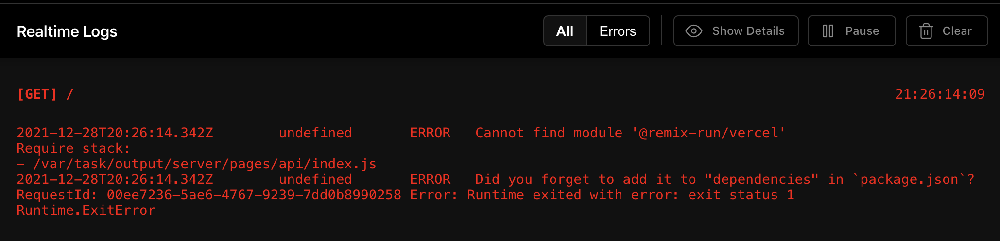
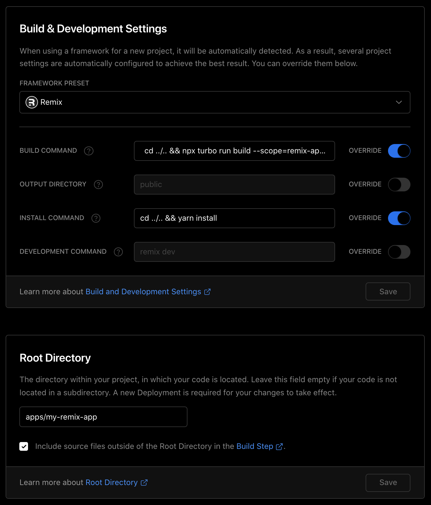

# Example Project turborepo & remix & vercel

Example monorepo ([yarn workspaces](https://classic.yarnpkg.com/lang/en/docs/workspaces/) & [turborepo](https://turborepo.org/)) project with a [remix](https://remix.run/) [sub-package](https://github.com/marcolink/turbo-remix/tree/main/apps/my-remix-app). 

## The Problem
When building on [vercel](https://vercel.com), and running afterwards, the function throws following error


#### Build settings:


#### Build command
```shell
  cd ../.. && npx turbo run build --scope=remix-app-template --include-dependencies --no-deps  --no-cache --concurrency=1
```


